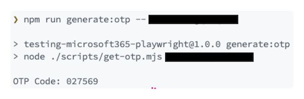

# E2E Testing of Microsoft 365 solutions with Playwright

This repository can be used as a template to get started with [Playwright](https://playwright.dev/) to test Microsoft 365 solutions.

> More information can be found in the blog post [End-to-End Test Microsoft 365 Solutions with Playwright](https://www.eliostruyf.com/test-microsoft-365-solutions-playwright/).

## Installation

- Clone this repository or use it as a template
- Run `npm install` to install the dependencies
- Run `npx playwright install` to install the browsers

## Configuration

To get started, you need to configure the following environment variables:

```bash
M365_PAGE_URL=
M365_USERNAME=
M365_PASSWORD=

# When using the MFA login flow
M365_OTP_SECRET=
```

### MFA login flow

If your account needs to use MFA to login, you will have to do the following:

- Go to the [Security info](https://mysignins.microsoft.com/security-info) page of the account you want to use
- Click on the **Add sign-in method** button
- Select **Authenticator app** and click on **Add**
- Click on the **I want to use a different authenticator app** link
- Click on the **Next** button
- Click on the **Can't scan image?** link
- Copy the **Secret key** and paste it in the `M365_OTP_SECRET` environment variable
- Use your authenticator app to scan the QR code
- Click on the **Next** button
- Enter the code from your authenticator app and click on the **Next** button

> [!NOTE]
> The secret key is only shown once. If you lose it, you will have to remove the authenticator app and add it again.

If you do not want to use an authenticator app for creating the OTP, you can use the following command to generate the OTP:

```bash
npm run generate:otp -- <secret key>
```



> [!NOTE]
> This command executes the [get-otp.mjs](./scripts/get-otp.mjs) script.

## Run the tests

In the `tests` folder, you can find a sample test that navigates to SharePoint and verifies the Site Title. You can start from there or create your own tests.

> **Important**: the `login.setup.ts` or `mfa.setup.ts` file contains the code to login to Microsoft 365. It is configured to run before all tests in the `playwright.config.ts` file.

To run the tests, execute the following command:

```bash
npm test
```

There are two optional scripts available:

- `npm run test:ui` to run the tests in UI mode
- `npm run test:debug` to run the tests in debug mode

## Running tests in GitHub Actions

The project contains a GitHub Actions workflow that runs the tests in a GitHub-hosted runner. The workflow is configured to run on a schedule, or you can manually trigger it.

You can find the workflow in the `.github/workflows` folder.

To use the workflow, you need to configure the following secrets and variables in your repository:

### Variables

- `M365_PAGE_URL`

### Secrets

- `M365_USERNAME`
- `M365_PASSWORD`
- `M365_OTP_SECRET` (only when using MFA)
